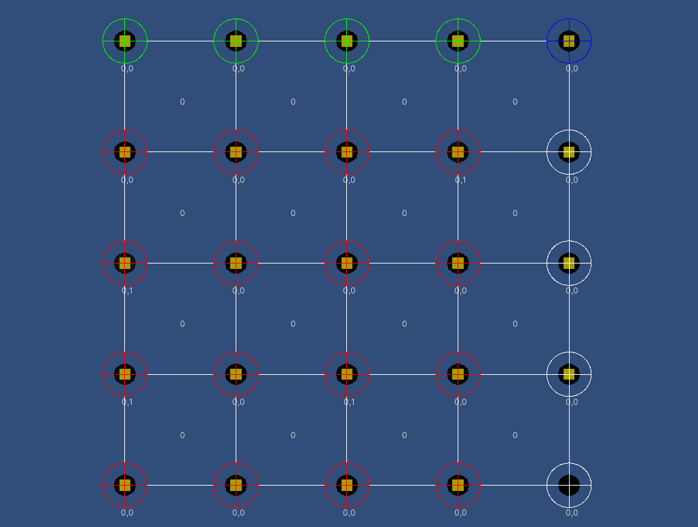

# Interpolated Marching Squares over Scalar Field
  
It's an experimental project about generating procedural meshes (marching squares) over a scalar field.

## Room for Improvements
- Threading
- World partitioning by chunks + quad tree
